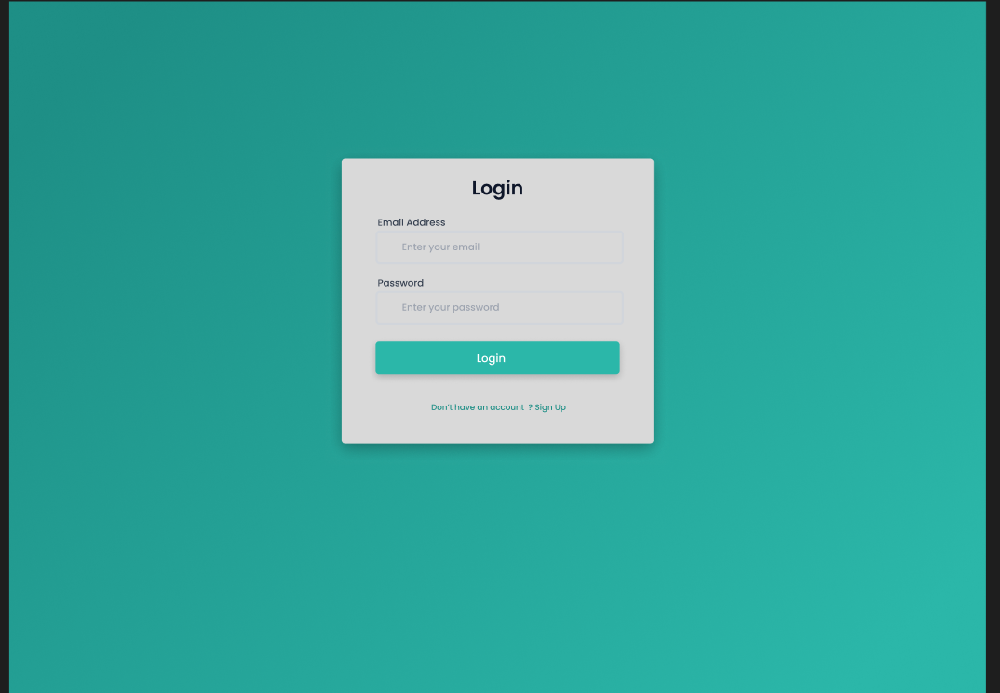
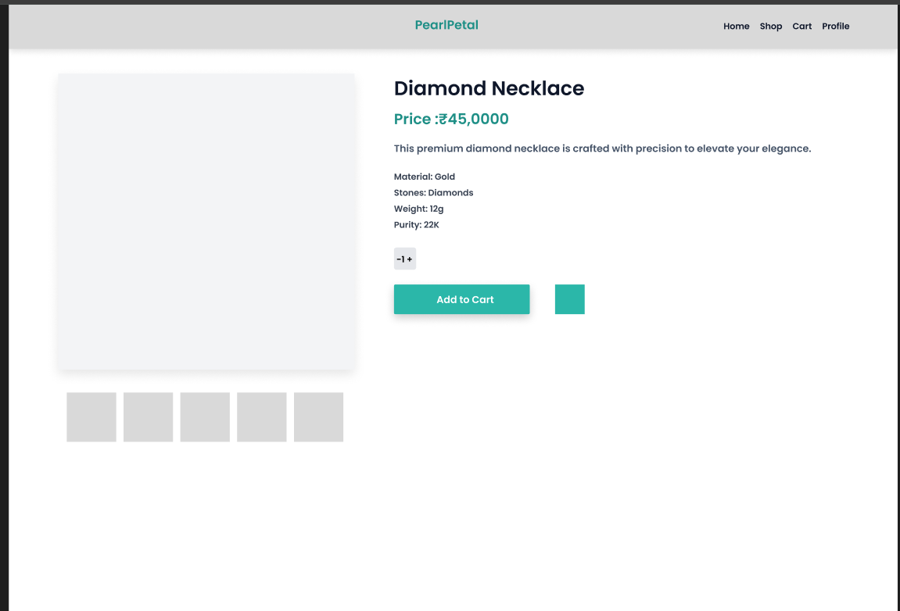
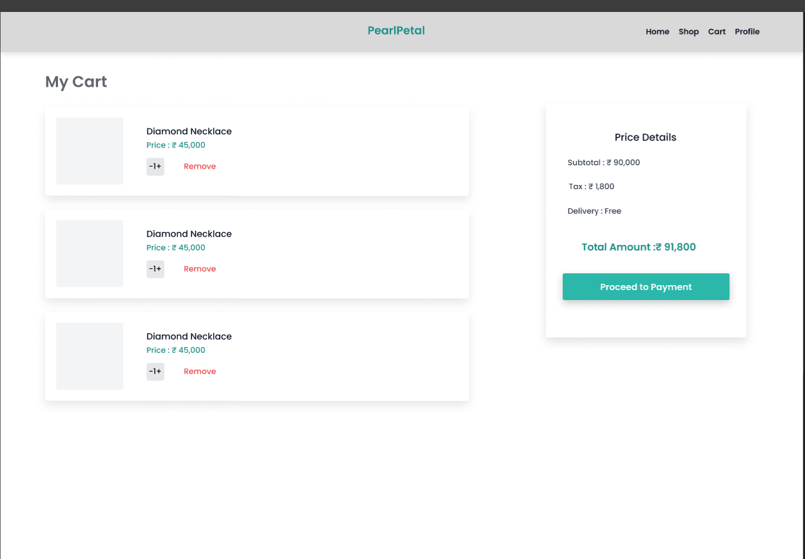

# MERN Stack Jewellery E-Commerce Web Application

## 1. Project Title

Jewellery E-Commerce Web Application using MERN Stack

---

## 2. Project Objective

The objective of this project is to develop a full-stack Jewellery E-Commerce web application that allows users to browse jewellery products, manage a shopping cart, authenticate securely, and place orders online.

---

## 3. Project Description

This project is a full-stack Jewellery E-Commerce application developed using the MERN stack.  
It provides users with an interactive interface to explore jewellery products, view product details, add items to the cart, and place orders.

The frontend is built using **React.js with Vite**, while the backend is developed using **Node.js, Express.js, and MongoDB**.  
JWT authentication and password hashing are implemented to ensure secure user login and protected API access.

---

## 4. Team Details

| Name         | Email                    |
| ------------ | ------------------------ |
| Madhura Wagh | madhurawagh181@gmail.com |
| Sujal Pawar  | suajlpaward2p@gmail.com  |

## 5. Technologies Used

### Frontend

- React.js
- Vite
- HTML5
- CSS3
- JavaScript
- Axios
- React Router DOM

### Backend

- Node.js
- Express.js
- MongoDB
- Mongoose
- JWT Authentication
- bcrypt.js

### Tools

- Antigravity / VS Code
- Git & GitHub
- Postman
- MongoDB Compass

---

## 6. Folder Structure

MadhuraWagh_25WDFSWDA4NOV8142_MajorProject/
│
├── frontend/
│ ├── public/
│ ├── src/
│ │ ├── components/
│ │ ├── pages/
│ │ ├── services/
│ │ ├── App.jsx
│ │ └── main.jsx
│ ├── index.html
│ ├── package.json
│ └── vite.config.js
│
├── backend/
│ ├── models/
│ ├── node_modules/
│ ├── .env/
│ ├── seed.js
│ └── server.js
│
├── screenshots/
│ ├── login.png
│ ├── HomePage.png
│ ├── product.png
│ └── cart.png
│
├── README.md
└── .gitignore

## 7. Features Implemented

### Authentication

- User registration and login
- Password encryption using bcrypt
- JWT-based authentication
- Protected backend routes

### Product Management

- Jewellery product listing
- Product details page
- Dynamic routing using product ID

### Cart Features

- Add products to cart
- Remove products from cart
- Quantity management
- Cart data handling

### Order Flow

- Order placement
- Backend order handling
- Order confirmation page

---

## 8. Screenshots of the Project

## 9. Live Project Link

Not Deployed

---

## 10. Challenges Faced

- Integrating frontend with backend APIs
- Managing authentication securely
- Handling cart state efficiently
- Debugging React component rendering issues

---

## 11. Conclusion

This Jewellery E-Commerce project provided hands-on experience with MERN stack development.  
It helped in understanding real-world application structure, secure authentication, and frontend-backend integration.  
The project fulfills the major project requirements as specified in the guidelines.

---
